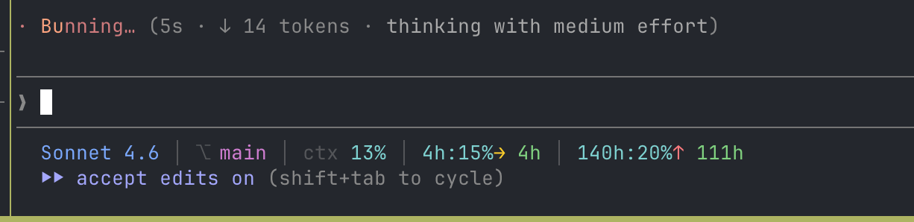

# claude-statusline

A bash script that formats Claude Code's [statusline JSON](https://code.claude.com/docs/en/statusline#full-json-schema) into a readable status bar.



Model, git branch, context window %, 5h and 7d rate limits with pace indicators.

## Background

Claude Code pipes a JSON object to a shell command via stdin on every render (the [`statusLine` config](https://code.claude.com/docs/en/statusline)). On Pro/Max plans this JSON includes a `rate_limits` field with 5-hour and 7-day usage percentages and reset times.

This script parses that JSON with `jq`. Single bash file, no extra dependencies. Visual style inspired by [isaacaudet/claude-code-statusline](https://github.com/isaacaudet/claude-code-statusline).

## Install

```bash
cp statusline-command.sh ~/.claude/statusline-command.sh
chmod +x ~/.claude/statusline-command.sh
```

Add to `~/.claude/settings.json`:

```json
{
  "statusLine": {
    "command": "bash ~/.claude/statusline-command.sh"
  }
}
```

## Requirements

- Claude Code CLI
- `jq` (`brew install jq`)
- `bc` (usually pre-installed)
- Claude Pro or Max subscription (rate limits are not available on free/API plans)

## What it shows

- **Model** — color-coded by family: amber (Opus), cyan (Haiku), blue (Sonnet)
- **Git branch** — magenta, with `⎇` prefix
- **Context window %** — cyan under 50%, orange 50–80%, red above 80%
- **5h rate limit** — `time_until_reset:used%` format, color-coded by usage
- **7d rate limit** — same format, cyan

All fields are optional — if data isn't available yet, the section is skipped.

## Pace arrows

Each rate limit shows a pace arrow based on projected usage at reset time:

- `↑` red — burning fast, will hit the limit before reset. Followed by time-to-limit, colored by urgency relative to the window (red < 33%, orange < 66%, green otherwise)
- `→` yellow — on pace, roughly at 100% by reset
- `↓` green — under-consuming, won't hit the limit

Projection formula: `projected% = used% × window_duration / elapsed`. Suppressed during the first 2% of the window to avoid noise.
