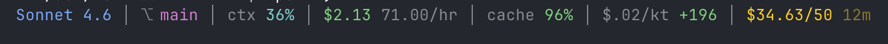

# claude-statusline

A bash script that formats Claude Code's [statusline JSON](https://code.claude.com/docs/en/statusline#full-json-schema) into a readable status bar.


Model, git branch, context window %, 5h and 7d rate limits with pace indicators.

On API/enterprise plans (no `rate_limits` in the JSON), the script shows session cost, burn rate, cache hit rate, cost per 1k tokens, net lines changed, and budget tracking across sessions.



## Background

Claude Code pipes a JSON object to a shell command via stdin on every render (the [`statusLine` config](https://code.claude.com/docs/en/statusline)). On Pro/Max plans this JSON includes a `rate_limits` field with 5-hour and 7-day usage percentages and reset times. On API/enterprise plans that field is absent, but `cost` data (session spend, API duration, lines changed) is available.

This script parses that JSON with `jq`. Single bash file, no extra dependencies. Visual style inspired by [isaacaudet/claude-code-statusline](https://github.com/isaacaudet/claude-code-statusline).

## Install

```bash
cp statusline-command.sh ~/.claude/statusline-command.sh
chmod +x ~/.claude/statusline-command.sh
```

Add to `~/.claude/settings.json`:

```json
{
  "statusLine": {
    "command": "bash ~/.claude/statusline-command.sh"
  }
}
```

## Requirements

- Claude Code CLI
- `jq` (`brew install jq`)
- `bc` (usually pre-installed)
- Claude Pro, Max, or API/enterprise plan

## What it shows

### Pro/Max plans

- **Model** — color-coded by family: amber (Opus), cyan (Haiku), blue (Sonnet)
- **Git branch** — magenta, with `⎇` prefix
- **Context window %** — cyan under 50%, orange 50-80%, red above 80%
- **5h rate limit** — `time_until_reset:used%` format, color-coded by usage
- **7d rate limit** — same format, cyan

### API/enterprise plans

When `rate_limits` is absent, the script shows cost metrics instead. Example: `$2.13 71.00/hr │ cache 96% │ $.02/kt +196 │ $34.63/50 12m`

- **Session cost** — `$2.13`, total cost of the current conversation
- **Active burn rate** — `71.00/hr`, dollars per hour of API time (not wall clock, so idle time doesn't skew it)
- **Cache hit rate** — `cache 96%`, percentage of cached input tokens vs newly created ones. Green above 80%, cyan 50-80%, orange below. High cache rates mean you're paying ~10% per token instead of full price for repeated context
- **Cost per 1k tokens** — `$.02/kt`, session cost divided by total tokens (input + output). Captures all work, not just lines changed
- **Net lines** — `+196`, lines added minus removed. Green if positive, red if negative
- **Budget** — `$34.63/50 12m`, accumulated spend across sessions vs budget, with estimated time remaining at current burn rate

### Budget tracking (API plans)

Each session's cost is persisted to `$CLAUDE_CONFIG_DIR/usage/` (or `~/.claude/usage/`). To track spend against a budget, create a config file:

```bash
mkdir -p ~/.claude/usage
cat > ~/.claude/usage/.config << EOF
budget=50
initial_usage=32.50
start_ts=$(date +%s)
EOF
```

- `budget` — total budget in dollars
- `initial_usage` — spend already consumed before tracking started
- `start_ts` — epoch timestamp, only sessions after this are counted

Color-coded: cyan under 50%, yellow 50-80%, red above 80%. Time remaining is based on the current session's active burn rate.

#### Syncing with the web console

The script tracks cost locally using `total_cost_usd` from the statusline JSON, which can drift from the billed amount on the web console. To re-sync, set `initial_usage` to the real value and move `start_ts` to now so existing session files (already counted in the billed amount) aren't double-summed:

```bash
bash statusline-command.sh usage 215.09
sed -i '' "s/^start_ts=.*/start_ts=$(date +%s)/" ~/.claude/usage/.config
```

Alternatively, use the `sync` subcommand which writes negative offsets for existing sessions instead of using timestamp filtering:

```bash
bash statusline-command.sh sync 215.09
```

If you're using Claude Code, a `/set-budget` slash command is available in `.claude/commands/set-budget.md` — copy it to `~/.claude/commands/` to use it from any project.

### Common fields

All fields are optional — if data isn't available yet, the section is skipped. Rate limit data only appears after a full message exchange (send + response), since Claude Code updates the statusline on each render using the API response headers.

## Pace arrows

Each rate limit shows a pace arrow based on projected usage at reset time:

- `↑` red — burning fast, will exhaust the limit before reset. Followed by the estimated time until you hit 100% (e.g. `↑ 2h` = limit reached in ~2 hours). Color reflects urgency: red if under 33% of the window remains, orange under 66%, green otherwise
- `→` yellow — on pace, roughly at 100% by reset
- `↓` green — under-consuming, won't hit the limit

Projection formula: `projected% = used% × window_duration / elapsed`. Suppressed during the first 2% of the window to avoid noise.
